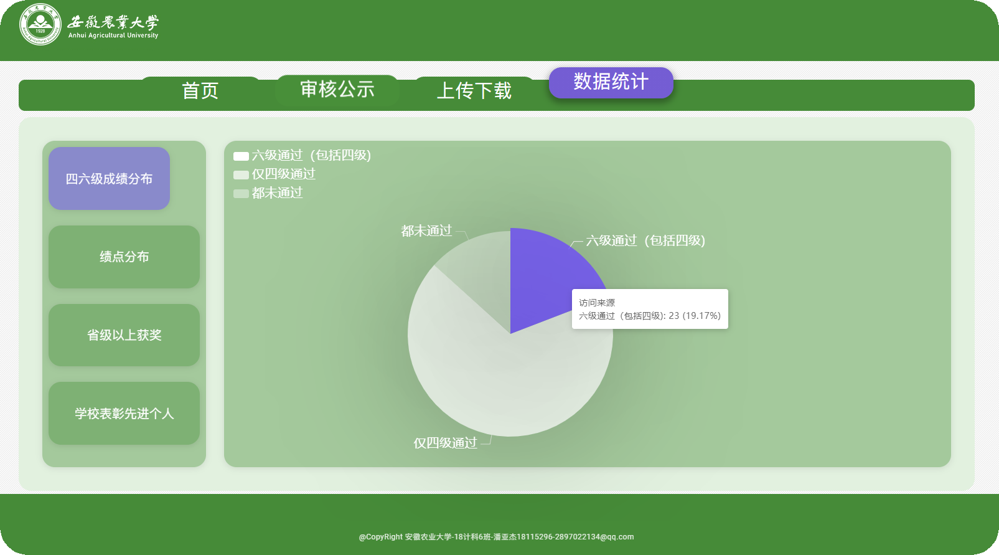
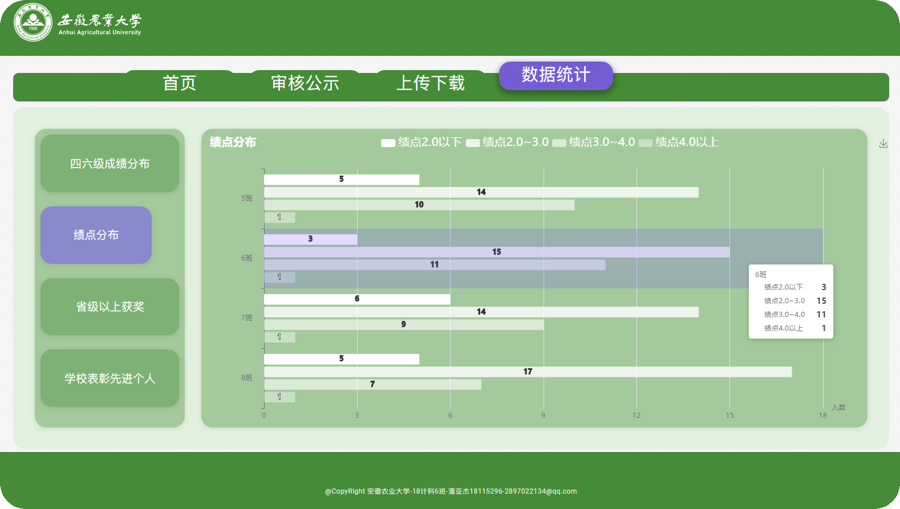
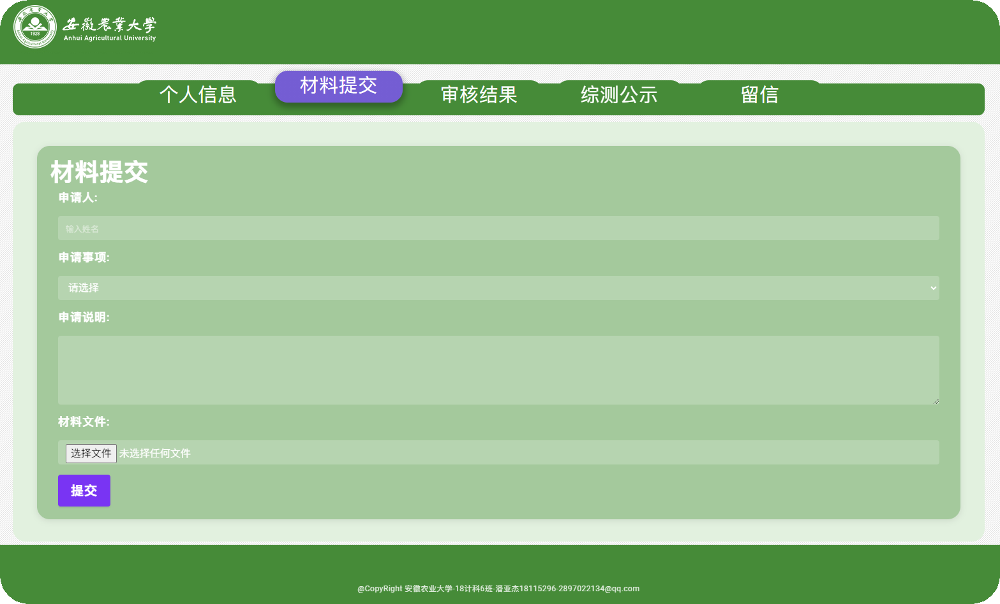
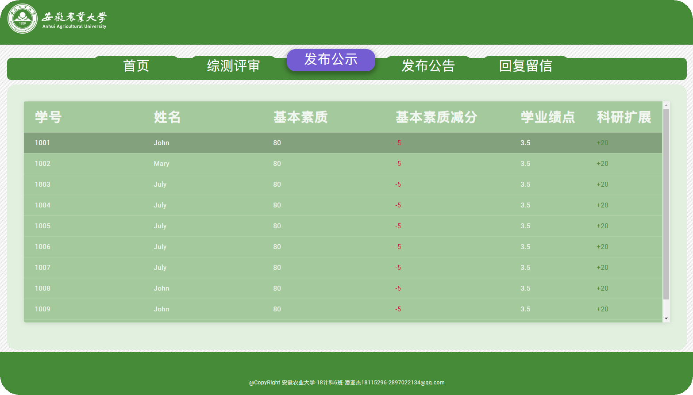
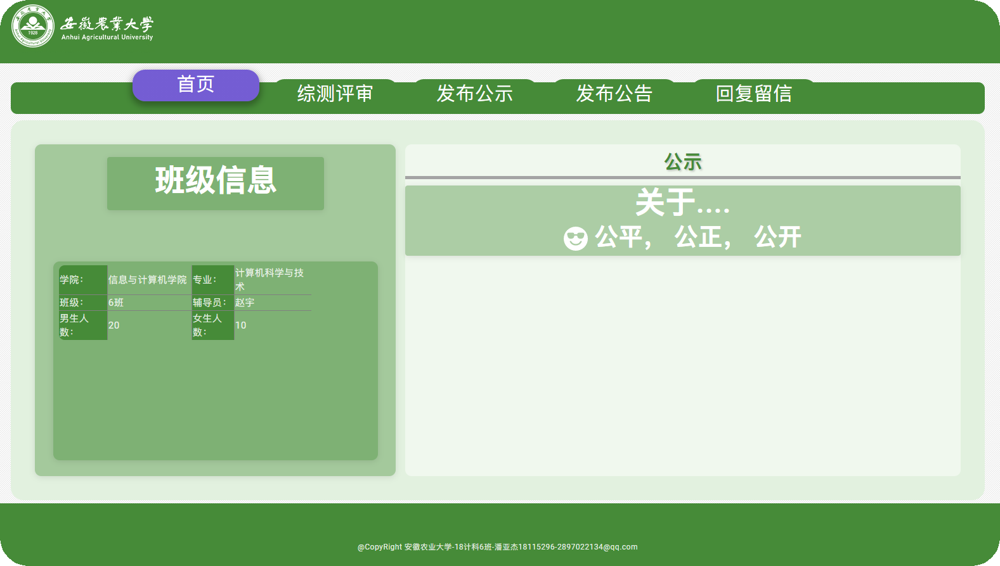

本来只是静态的网页设计，后来我自己希望能尝试学习进行一个完整的服务器搭建
所以开设了这个项目

**Gitee：** https://gitee.com/yinghaidada/ahauhtml  
**GitHub：** https://github.com/YINGHAIDADA/ahauhtml 

## Internet作业进度

> **登录页面**
>
> > Login
>
> **学生页面**
>
> > 个人信息
> >
> > 材料提交
> >
> > 审核结果
> >
> > 综测公示
> >
> > 留信
>
> **班级管理者界面**
>
> > 首页
> >
> > 综测评审
> >
> > 发布公示
> >
> > 发布公告
> >
> > 回复留言
>
> **老师界面**
>
> >审核公示
> >
> >上传下载
> >
> >数据统计
## 页面展示

> 
> 
> 
> 
> 
> 
> 
> 
> 

## 技术总结
* Python语言
* Flask网页框架
* CSS样式设计
* Markdown展示语言

